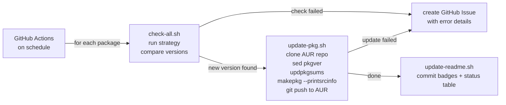

# aurtomator

<!-- BADGES:START -->
    
<!-- BADGES:END -->

Automated AUR package updates from a single GitHub repo.
Fork it, drop in your packages, let CI handle the rest.

## Packages

<!-- PACKAGES:START -->

| Package | Version | Strategy | Updated | Status |
|---------|---------|----------|---------|--------|
| *No packages configured* | — | — | — | — |
<!-- PACKAGES:END -->

*Auto-generated by CI after each run.*

## How it works

Each package has a YAML config pointing to an upstream source. When a new version is detected, the existing PKGBUILD on AUR is patched in place -- version bumped, checksums regenerated, .SRCINFO rebuilt, committed and pushed. If anything fails, a GitHub Issue is opened automatically.

aurtomator does **not** generate PKGBUILDs. Your packages already exist on AUR with working PKGBUILDs. This works for all package types -- cmake, meson, binary, split, `-git`.

## Quick start

1. Fork this repo (or use as template)
2. Enable Actions and Issues in your fork's Settings ([why?](docs/SETUP.md#after-forking))
3. Run `./scripts/setup.sh` ([detailed guide](docs/SETUP.md))
4. Add a package: `cp packages/example.yml.sample packages/<name>.yml`
5. Validate: `./scripts/validate-pkg.sh <name>`
6. Push and let CI handle the rest

The setup script configures your identity (git author for AUR commits), SSH access, and GitHub Secrets. If you use [gh CLI](https://cli.github.com/), secrets are set automatically. Without it, the script prints manual instructions. GPG commit signing is optional.

See [docs/SETUP.md](docs/SETUP.md) for the full setup guide.

## Strategies

13 built-in version detection strategies:

| Strategy           | Source              | Use for                              |
|--------------------|---------------------|--------------------------------------|
| `github-release`   | GitHub Releases API | GitHub-hosted projects with releases |
| `github-tag`       | GitHub Tags API     | GitHub projects without releases     |
| `github-nightly`   | GitHub Releases API | Nightly/prerelease builds (4 patterns) |
| `gitlab-tag`       | GitLab Tags API     | Any GitLab instance                  |
| `gitea-tag`        | Gitea/Forgejo API   | Codeberg, self-hosted Gitea          |
| `git-latest`       | `git clone --bare`  | `-git` packages, any git repo        |
| `pypi`             | PyPI JSON API       | Python packages                      |
| `npm`              | npm registry        | Node.js packages                     |
| `crates`           | crates.io API       | Rust crates                          |
| `repology`         | Repology API        | Universal fallback (120+ repos)      |
| `archpkg`          | Arch repos API      | Rebuild triggers, dependency tracking|
| `webpage-scrape`   | URL + regex         | Anything not covered above           |
| `kde-tarball`      | download.kde.org    | KDE/Plasma packages                  |

See [docs/WORKFLOW.md](docs/WORKFLOW.md) for strategy details, YAML examples, and how to write custom strategies.

## Resource usage

All packages run in a single workflow -- one Arch container, one SSH/GPG setup, one run. A version check is one HTTP request per package. This keeps GitHub Actions minutes usage minimal.

## Documentation

- [Setup guide](docs/SETUP.md) -- first-time configuration, prerequisites, troubleshooting
- [Workflow reference](docs/WORKFLOW.md) -- strategies, update process, CI pipeline, local testing, custom strategies

## Alternatives

| Tool              | Best for                 | Approach                                         |
|-------------------|--------------------------|--------------------------------------------------|
| [nvchecker]       | Version detection only   | Python, 42+ sources, no AUR push                 |
| [lilac]           | Large repos (archlinuxcn)| Full build bot, needs own infra                  |
| [aur-auto-update] | Centralized service      | Requires bot co-maintainer on AUR                |
| [Renovate]        | Multi-ecosystem          | Enterprise-grade, heavy config                   |
| **aurtomator**    | Individual maintainers   | Fork and go, bash, zero dependencies beyond Arch |

[nvchecker]: https://github.com/lilydjwg/nvchecker
[lilac]: https://github.com/archlinuxcn/lilac
[aur-auto-update]: https://github.com/arch4edu/aur-auto-update
[Renovate]: https://docs.renovatebot.com/user-stories/maintaining-aur-packages-with-renovate/

## License

BSD-3-Clause
