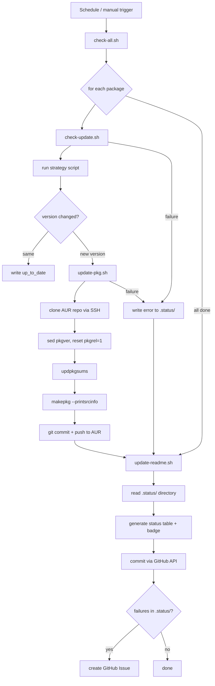

# Aurtomator Workflow Reference

Comprehensive documentation for aurtomator -- an automated AUR package update system.
Target audience: Arch Linux power users and AUR maintainers.

---

## Table of Contents

1. [Overview](#1-overview)
2. [Package YAML Format](#2-package-yaml-format)
3. [Strategies](#3-strategies)
4. [Update Process](#4-update-process)
5. [CI Workflow: check-updates.yml](#5-ci-workflow-check-updatesyml)
6. [CI Quality Gate: ci.yml](#6-ci-quality-gate-ciyml)
7. [Local Testing](#7-local-testing)
8. [Writing Custom Strategies](#8-writing-custom-strategies)

---

## 1. Overview

Aurtomator automates version bumps for AUR packages you already maintain. It does
**not** generate PKGBUILDs from scratch -- it patches the `pkgver` in an existing
PKGBUILD on AUR, regenerates checksums and `.SRCINFO`, and pushes the update.

### End-to-end flow



### Key design decisions

- **One YAML per package.** No monolithic config file. Easy to add/remove packages.
- **Strategy-based version detection.** Each upstream source type has its own script.
  Adding a new source is just adding a new script -- no core code changes needed.
- **Patch, not generate.** Aurtomator trusts your existing PKGBUILD. It only changes
  `pkgver`, `pkgrel`, checksums, and `.SRCINFO`. Build systems, dependencies, install
  files -- all untouched.
- **Single workflow run.** All packages are checked in one CI job. One Arch container,
  one SSH/GPG setup. A version check is one HTTP request per package.
- **Failure isolation.** A broken package does not block others. Errors are logged per
  package and result in GitHub Issues.

---

## 2. Package YAML Format

Each package has a file at `packages/<name>.yml`. The filename must match the `name`
field and the AUR package name.

### Required fields

| Field      | Type   | Description                                                  |
|------------|--------|--------------------------------------------------------------|
| `name`     | string | AUR package name (must match filename)                       |
| `strategy` | string | Version detection strategy (see [Strategies](#3-strategies)) |
| `upstream` | object | Strategy-specific upstream configuration                     |

### Optional fields

| Field     | Type   | Description                                                    |
|-----------|--------|----------------------------------------------------------------|
| `current` | string | Currently tracked version. Updated automatically after pushes. |

### Upstream fields by strategy

The `upstream` object varies depending on the strategy. See each strategy section
below for the exact fields required.

### Minimal example

```yaml
name: my-package
strategy: github-release
upstream:
  type: github
  project: owner/repo
```

### Full example with current version

```yaml
name: my-package
strategy: github-release
upstream:
  type: github
  project: owner/repo
current: "2.1.0"
```

### Naming rules

- The YAML filename must be `packages/<name>.yml` where `<name>` is the exact AUR
  package name.
- The `name` field inside the YAML must match the filename (without `.yml`).
- Strategy names correspond to scripts in `strategies/` (without `.sh`).

---

## 3. Strategies

Aurtomator ships 13 built-in strategies. Each strategy is a standalone bash script in
`strategies/` that receives a package name, reads the package YAML for upstream
config, queries the upstream source, and outputs a single version string to stdout.

All strategies:

- Source `scripts/lib.sh` for YAML helpers and logging
- Use `curl` for HTTP requests (30-second timeout)
- Strip `v` prefixes from version tags where applicable
- Exit non-zero on failure with error messages on stderr

---

### 3.1 github-release

**What it checks:** GitHub Releases API (`/repos/{owner}/{repo}/releases/latest`).

**When to use:** GitHub-hosted projects that publish formal releases.

**YAML fields:**

| Field              | Required | Description               |
|--------------------|----------|---------------------------|
| `upstream.type`    | no       | `github`                  |
| `upstream.project` | yes      | `owner/repo` format       |

**How version is extracted:**
Fetches the latest release object, reads `.tag_name`, strips leading `v`.

**Authentication:** If `GITHUB_TOKEN` is set in the environment, it is sent as a
Bearer token. Not required for public repos but avoids rate limits.

**Example YAML:**

```yaml
name: my-package
strategy: github-release
upstream:
  project: owner/repo
```

**Custom tag format** — for projects with non-standard tags (e.g., `MeshLab-2025.07`,
`0.1.8-stable`), use `tag_version_regex` with an ERE capture group:

```yaml
name: meshlab-bin
strategy: github-release
upstream:
  project: cnr-isti-vclab/meshlab
  tag_version_regex: 'MeshLab-(.*)'
```

The captured group becomes the version. If omitted, the default `v` prefix strip applies.
This field also works with `github-tag` and `github-nightly` strategies.

---

### 3.2 github-tag

**What it checks:** GitHub Tags API (`/repos/{owner}/{repo}/tags`).

**When to use:** GitHub projects that use git tags but do not publish formal releases.

**YAML fields:**

| Field                  | Required | Description                             |
|------------------------|----------|-----------------------------------------|
| `upstream.type`        | no       | `github`                                |
| `upstream.project`     | yes      | `owner/repo` format                     |
| `upstream.tag_pattern` | no       | Glob pattern to filter tags (e.g. `v*`) |

**How version is extracted:**
Fetches the latest 100 tags, optionally filters by `tag_pattern` (converted to regex),
strips `v` prefix, sorts with `sort -V` (version sort), and returns the highest.

**Authentication:** Same as `github-release`.

**Example YAML:**

```yaml
name: my-package
strategy: github-tag
upstream:
  type: github
  project: owner/repo
  tag_pattern: "v*"
```

---

### 3.3 github-nightly

Detects versions from GitHub nightly/prerelease builds. Supports 4 patterns:

**Pattern A: Fixed tag** (default) — a single tag force-pushed daily (neovim, ghostty, yazi):

```yaml
name: neovim-nightly-bin
strategy: github-nightly
upstream:
  project: neovim/neovim
  nightly_tag: nightly
  version_source: release_body
  version_pattern: 'NVIM v\K\S+'
```

**Pattern B: Dated tags** — tags like `nightly-2026-03-26` (ruffle, servo):

```yaml
name: ruffle-nightly-bin
strategy: github-nightly
upstream:
  project: nicknisi/ruffle-builds
  nightly_tag: "nightly-"
  version_source: tag_date
```

**Pattern C: Separate nightly repo** — standard `/releases/latest` on a dedicated build repo (yt-dlp):

```yaml
name: yt-dlp-nightly-bin
strategy: github-nightly
upstream:
  project: yt-dlp/yt-dlp-nightly-builds
  nightly_tag: latest
  version_source: tag
```

**Pattern D: Channel filter** — filter releases by name containing a channel string (brave):

```yaml
name: brave-nightly-bin
strategy: github-nightly
upstream:
  project: brave/brave-browser
  channel: Nightly
  version_source: tag
```

**Fields:**

| Field | Required | Description |
|-------|----------|-------------|
| `upstream.project` | yes | `owner/repo` |
| `upstream.nightly_tag` | no | Tag name or prefix (default: `"nightly"`, use `"latest"` for pattern C) |
| `upstream.version_source` | no | `"tag"` (default), `"release_body"`, `"tag_date"`, `"published_date"` |
| `upstream.version_pattern` | for `release_body` | Perl regex to extract version from release body |
| `upstream.channel` | for pattern D | Filter releases by name containing this string |

---

### 3.4 gitlab-tag

**What it checks:** GitLab Tags API (`/api/v4/projects/{id}/repository/tags`).

**When to use:** Any GitLab instance -- gitlab.com, invent.kde.org, self-hosted, etc.

**YAML fields:**

| Field                  | Required | Description                                           |
|------------------------|----------|-------------------------------------------------------|
| `upstream.host`        | yes      | GitLab hostname (e.g. `invent.kde.org`, `gitlab.com`) |
| `upstream.project`     | yes      | Project path (e.g. `network/my-kde-app`)              |
| `upstream.tag_pattern` | no       | Glob pattern to filter tags                           |

**How version is extracted:**
URL-encodes the project path (`/` becomes `%2F`), fetches the latest 100 tags,
optionally filters by pattern, strips `v` prefix, version-sorts, returns the highest.

**Example YAML:**

```yaml
name: my-kde-app
strategy: gitlab-tag
upstream:
  type: gitlab
  host: invent.kde.org
  project: network/my-kde-app
```

---

### 3.5 gitea-tag

**What it checks:** Gitea/Forgejo Tags API (`/api/v1/repos/{owner}/{repo}/tags`).

**When to use:** Codeberg, self-hosted Gitea/Forgejo instances.

**YAML fields:**

| Field                  | Required | Description                              |
|------------------------|----------|------------------------------------------|
| `upstream.host`        | yes      | Instance hostname (e.g. `codeberg.org`)  |
| `upstream.project`     | yes      | `owner/repo` format                      |
| `upstream.tag_pattern` | no       | Glob pattern to filter tags              |

**How version is extracted:**
Fetches the latest 50 tags, optionally filters by pattern, strips `v` prefix,
version-sorts, returns the highest.

**Example YAML:**

```yaml
name: my-package
strategy: gitea-tag
upstream:
  type: gitea
  host: codeberg.org
  project: owner/repo
```

---

### 3.6 git-latest

**What it checks:** Any git repository via bare clone.

**When to use:** `-git` AUR packages that track the latest commit on a branch.

**YAML fields:**

| Field              | Required | Description                                                   |
|--------------------|----------|---------------------------------------------------------------|
| `upstream.type`    | yes      | One of: `github`, `gitlab`, `git`                             |
| `upstream.host`    | depends  | Required for `gitlab` type                                    |
| `upstream.project` | depends  | Required for `github` and `gitlab` types                      |
| `upstream.url`     | depends  | Required for `git` type -- full clone URL                     |

**How version is extracted:**
Clones the repo as a bare repository into a temporary directory, counts all commits on
HEAD (`git rev-list --count HEAD`), gets the short hash (`git rev-parse --short=7 HEAD`),
and outputs in the standard `-git` pkgver format: `r<count>.<shorthash>`.

Example output: `r431.66db9ce`

**Cleanup:** The temporary bare clone is removed via `trap` on exit.

**Example YAML (GitHub):**

```yaml
name: my-package-git
strategy: git-latest
upstream:
  type: github
  project: owner/repo
```

**Example YAML (GitLab):**

```yaml
name: my-package-git
strategy: git-latest
upstream:
  type: gitlab
  host: invent.kde.org
  project: network/my-kde-app
```

**Example YAML (arbitrary git URL):**

```yaml
name: my-package-git
strategy: git-latest
upstream:
  type: git
  url: "https://git.sr.ht/~user/repo"
```

---

### 3.7 pypi

**What it checks:** PyPI JSON API (`https://pypi.org/pypi/{package}/json`).

**When to use:** Python packages published on PyPI.

**YAML fields:**

| Field               | Required | Description                                  |
|---------------------|----------|----------------------------------------------|
| `upstream.registry` | yes      | PyPI package name (e.g. `requests`, `flask`) |

**How version is extracted:**
Fetches the package JSON, reads `.info.version` which is the latest stable release
on PyPI.

**Example YAML:**

```yaml
name: python-requests
strategy: pypi
upstream:
  registry: requests
```

---

### 3.8 npm

**What it checks:** npm registry (`https://registry.npmjs.org/{package}/latest`).

**When to use:** Node.js packages published on npm.

**YAML fields:**

| Field               | Required | Description                                  |
|---------------------|----------|----------------------------------------------|
| `upstream.registry` | yes      | npm package name (e.g. `express`, `webpack`) |

**How version is extracted:**
Fetches the `latest` tag metadata, reads `.version`.

**Example YAML:**

```yaml
name: nodejs-express
strategy: npm
upstream:
  registry: express
```

---

### 3.9 crates

**What it checks:** crates.io API (`https://crates.io/api/v1/crates/{crate}`).

**When to use:** Rust crates published on crates.io.

**YAML fields:**

| Field               | Required | Description                        |
|---------------------|----------|------------------------------------|
| `upstream.registry` | yes      | Crate name (e.g. `serde`, `tokio`) |

**How version is extracted:**
Fetches the crate metadata, reads `.crate.max_stable_version`. This ensures
pre-release versions are excluded.

**Note:** Sends `User-Agent: aurtomator/1.0` as required by the crates.io API policy.

**Example YAML:**

```yaml
name: rust-serde
strategy: crates
upstream:
  registry: serde
```

---

### 3.10 repology

**What it checks:** Repology API (`https://repology.org/api/v1/project/{name}`).

**When to use:** Universal fallback. Repology tracks versions across 120+ package
repositories. Good for packages where no other strategy fits.

**YAML fields:**

| Field               | Required | Description                                                       |
|---------------------|----------|-------------------------------------------------------------------|
| `upstream.repology` | no       | Repology project name. Defaults to the package `name` if omitted. |

**How version is extracted:**
Fetches the project's entries from all tracked repositories, filters for entries with
`status == "newest"`, and returns the version from the first match.

**Note:** Sends `User-Agent: aurtomator/1.0` as requested by Repology API guidelines.

**Example YAML:**

```yaml
name: my-package
strategy: repology
upstream:
  repology: my-package
```

**Example YAML (using package name as default):**

```yaml
name: my-package
strategy: repology
upstream: {}
```

---

### 3.11 archpkg

**What it checks:** Arch Linux official package search API
(`https://archlinux.org/packages/search/json/?name={name}`).

**When to use:** AUR packages that track versions of official Arch packages -- for
example, packages that need rebuilds when a dependency in the official repos is updated.

**YAML fields:**

| Field              | Required | Description                                                                |
|--------------------|----------|----------------------------------------------------------------------------|
| `upstream.archpkg` | no       | Package name in official repos. Defaults to the package `name` if omitted. |

**How version is extracted:**
Fetches the search results, reads `.results[0].pkgver`. Returns the version without
the pkgrel component.

**Example YAML:**

```yaml
name: my-qt6-addon
strategy: archpkg
upstream:
  archpkg: qt6-base
```

---

### 3.12 webpage-scrape

**What it checks:** Any HTTPS webpage, using a regex pattern to extract version strings.

**When to use:** Upstream sources that do not provide a structured API -- project
download pages, directory listings, changelogs, etc.

**YAML fields:**

| Field              | Required | Description                                                              |
|--------------------|----------|--------------------------------------------------------------------------|
| `upstream.url`     | yes      | HTTPS URL of the page to scrape                                          |
| `upstream.pattern` | yes      | ERE (Extended Regular Expression) with one capture group for the version |

**How version is extracted:**

1. Fetches the page (HTTPS only, max 5 redirects, max 5 MB).
2. Runs `grep -oE` with the pattern to find all matches.
3. Runs `sed -E` to extract the capture group (the version).
4. Sorts with `sort -Vu` (version sort, unique).
5. Returns the last (highest) version.

**Security:** Only HTTPS URLs are accepted. HTTP is rejected.

**Pattern rules:** The pattern must be a valid ERE regex with exactly one capture group
`(...)` that captures the version string.

**Example YAML:**

```yaml
name: my-scrape-pkg
strategy: webpage-scrape
upstream:
  type: webpage
  url: "https://www.example.com/~maintainer/my-scrape-pkg/"
  pattern: "my-scrape-pkg-([0-9.]+)\\.tar\\.gz"
```

**Common patterns:**

```text
# Standard tarball naming
"mypackage-([0-9]+\\.[0-9]+\\.[0-9]+)\\.tar\\.gz"

# With optional patch version
"mypackage-([0-9]+\\.[0-9]+(\\.[0-9]+)?)\\.tar\\.xz"

# Version in URL path
"/download/v([0-9.]+)/"
```

---

### 3.13 kde-tarball

**What it checks:** KDE download server directory listing
(`https://download.kde.org/stable/{name}/`).

**When to use:** KDE/Plasma packages that publish release tarballs on download.kde.org.

**YAML fields:**

No upstream fields are required beyond the standard `name`. The package name is used
directly to construct the download URL.

**How version is extracted:**

1. Fetches `https://download.kde.org/stable/{name}/`.
2. Uses a Perl-compatible regex to match `{name}-{version}.tar.xz` links.
3. Extracts the version part (digits and dots: `[0-9]+\.[0-9]+(\.[0-9]+)*`).
4. Sorts with `sort -Vu` and returns the highest.

**Example YAML:**

```yaml
name: my-kde-app
strategy: kde-tarball
upstream:
  type: gitlab
  host: invent.kde.org
  project: network/my-kde-app
```

Note: the `upstream` fields here are metadata for reference (and used by `git-latest`
if you have a companion `-git` package). The `kde-tarball` strategy itself only uses
the package `name`.

---

## 4. Update Process

When `check-all.sh --update` determines a package has a new version, it calls
`update-pkg.sh`. Here is what happens step by step.

### 4.1 Arguments

```text
update-pkg.sh <package-name> <new-version> [--dry-run]
```

### 4.2 Step-by-step

#### 1. Load configuration

Reads `.aurtomator.conf` if present. This sets `GIT_AUTHOR_NAME`, `GIT_AUTHOR_EMAIL`,
`GPG_KEY_ID`, and other variables. In CI, these are passed as environment variables
from GitHub Secrets (`AUR_GIT_NAME`, `AUR_GIT_EMAIL`).

#### 2. Create temporary directory

```bash
tmp_dir=$(mktemp -d)
trap 'rm -rf "$tmp_dir"' EXIT
```

A trap ensures cleanup even on error.

#### 3. Clone AUR repository

```bash
git clone ssh://aur@aur.archlinux.org/<package-name>.git "$aur_dir"
```

Uses SSH authentication. The SSH key must be configured for the `aur` user on
aur.archlinux.org (see the setup script).

#### 4. Verify PKGBUILD exists

Checks that `PKGBUILD` is present in the cloned repo. Exits with an error if missing.

#### 5. Update pkgver and reset pkgrel

```bash
sed -i "s/^pkgver=.*/pkgver=<new-version>/" PKGBUILD
sed -i "s/^pkgrel=.*/pkgrel=1/" PKGBUILD
```

Simple `sed` replacements. `pkgrel` is always reset to `1` on a version bump, per
Arch packaging convention.

#### 6. Regenerate checksums

```bash
updpkgsums
```

Downloads the source files and recalculates integrity arrays (sha256sums, etc.).
If `updpkgsums` fails (e.g. not available), a warning is logged but the process
continues.

#### 7. Regenerate .SRCINFO

```bash
makepkg --printsrcinfo > .SRCINFO
```

This is mandatory. AUR requires `.SRCINFO` to match the PKGBUILD. It is never
edited manually.

#### 8. Dry run check

If `--dry-run` was passed, the script prints the PKGBUILD diff and exits without
pushing:

```text
[DRY RUN] Would push my-package 2.0.0 to AUR
```

#### 9. Configure commit identity

```bash
git config user.name "${GIT_AUTHOR_NAME:-aurtomator}"
git config user.email "${GIT_AUTHOR_EMAIL:-aurtomator@users.noreply.github.com}"
```

Uses the identity configured during `setup.sh identity`. Falls back to `aurtomator`
if not set.

#### 10. Commit and push

```bash
git add PKGBUILD .SRCINFO
git commit -m "<new-version> release from <strategy>"
```

The commit message follows AUR convention: `"<version> release from <source>"`.

If `GPG_KEY_ID` is set, the commit is amended with GPG signing:

```bash
git -c user.signingkey="$GPG_KEY_ID" -c commit.gpgsign=true \
  commit --amend --no-edit
```

Then pushed to AUR:

```bash
git push
```

#### 11. Update package YAML

```bash
yq -i '.current = "<new-version>"' packages/<name>.yml
```

This updates the `current` field so the next check knows the package is at this
version.

---

## 5. CI Workflow: check-updates.yml

The main CI workflow runs on a schedule and handles the full update cycle.

### 5.1 Trigger

```yaml
on:
  schedule:
    - cron: "0 * * * *"  # every hour
  workflow_dispatch:
    inputs:
      force:
        description: "Skip schedule matching, check all packages now"
        type: boolean
        default: true
```

Runs hourly by default. Can be triggered manually from the GitHub Actions UI with
the `force` flag.

### 5.2 Permissions

```yaml
permissions:
  contents: write   # for committing changes
  issues: write     # for creating failure issues
```

Minimal permissions. No `packages`, no `deployments`, no admin access.

### 5.3 Container

```yaml
runs-on: ubuntu-latest
container: archlinux:base-devel
timeout-minutes: 30
```

Runs in an official Arch Linux container with `base-devel` (which includes `makepkg`,
`pacman`, etc.). The 30-minute timeout prevents stuck jobs from consuming minutes.

### 5.4 Step: Install dependencies

```bash
pacman -Syu --noconfirm --needed sudo git github-cli openssh gnupg namcap jq go-yq
useradd -m builder
echo "builder ALL=(ALL) NOPASSWD: ALL" >> /etc/sudoers
```

Installs all required tools and creates a non-root `builder` user. `makepkg` refuses
to run as root, so the `builder` user handles package operations.

### 5.5 Step: Checkout

```yaml
uses: actions/checkout@de0fac2e4500dabe0009e67214ff5f5447ce83dd # v6.0.2
```

Action versions are pinned by full commit SHA (not tag) for supply chain security.
The version tag is noted in a comment for human readability.

### 5.6 Step: Setup AUR SSH

Configures SSH access to `aur.archlinux.org` for the `builder` user only:

1. Writes the `AUR_SSH_KEY` secret to `/home/builder/.ssh/aur`.
2. Runs `ssh-keyscan` to populate `known_hosts`.
3. Creates `~builder/.ssh/config` with `IdentityFile`, `User`, and `StrictHostKeyChecking`
   directives.
4. Tests the connection with `sudo -u builder ssh -o BatchMode=yes aur@aur.archlinux.org`.

All scripts (`check-all.sh`, `update-pkg.sh`, `update-readme.sh`) run as `builder`.
Only the GitHub API commit and issue creation steps run as root (they use `GH_TOKEN`, not SSH).
`GH_TOKEN` is automatically provided by GitHub for every workflow run -- no setup required.
It is a short-lived token scoped to this repository with the permissions declared in the
workflow (`contents: write`, `issues: write`). It expires when the run finishes.

### 5.7 Step: Setup GPG

If the `GPG_SIGNING_KEY` secret is configured:

1. Imports the private key into the builder's GPG keyring.
2. Extracts the key ID.
3. Sets `GPG_KEY_ID` in `$GITHUB_ENV` for downstream steps.
4. Configures `git` to use this key for commit signing.

If no GPG key is configured, this step is silently skipped.

### 5.8 Step: Check and update packages

```bash
sudo -u builder env \
  GPG_KEY_ID="${GPG_KEY_ID:-}" \
  GIT_AUTHOR_NAME="${AUR_GIT_NAME:-aurtomator}" \
  GIT_AUTHOR_EMAIL="${AUR_GIT_EMAIL:-aurtomator@users.noreply.github.com}" \
  ./scripts/check-all.sh --update
```

Runs `check-all.sh` as the `builder` user with the `--update` flag, which both checks
and pushes updates to AUR. Identity environment variables `AUR_GIT_NAME` and
`AUR_GIT_EMAIL` are passed from GitHub Secrets (configured during `setup.sh identity`).
If not set, falls back to `aurtomator` as the commit author.

### 5.9 Step: Update README badges and status table

```bash
./scripts/update-readme.sh
```

Updates two sections in `README.md`:

1. **Badges** (between `<!-- BADGES:START -->` / `<!-- BADGES:END -->`) — auto-detects
   the repo from git origin and generates CI, Codecov, and static badges. For public
   repos, Codecov badge uses a tokenless URL. This makes badges work automatically in
   forks without manual URL changes.

2. **Package status table** (between `<!-- PACKAGES:START -->` / `<!-- PACKAGES:END -->`)
   — reads the `.status/` directory written by `check-all.sh` and regenerates the table.

#### .status/ directory format

`check-all.sh` writes one file per package in `.status/`:

| Filename               | Content                    | Meaning                          |
|------------------------|----------------------------|----------------------------------|
| `.status/<name>`       | `up_to_date`               | Package is at the latest version |
| `.status/<name>`       | `updated: 2.0.0`           | Successfully pushed to AUR       |
| `.status/<name>`       | `new_version: 2.0.0`       | Update found (check-only mode)   |
| `.status/<name>`       | `check_failed: <error>`    | Strategy execution failed        |
| `.status/<name>`       | `update_failed: <error>`   | AUR push failed                  |
| `.status/_error_count` | `0`                        | Total error count for the run    |

#### Dynamic badge

The README badge is dynamically generated:

```text
https://img.shields.io/badge/packages-<ok>%2F<total>-<color>
```

- Green (`brightgreen`) if all packages are OK (zero failures).
- Red (`red`) if any package failed.

#### Status table

Generated between `<!-- PACKAGES:START -->` and `<!-- PACKAGES:END -->` markers:

```markdown
| Package       | Version | Strategy       | Status           |
|---------------|---------|----------------|------------------|
| `my-package`  | 1.0.1   | kde-tarball    | up to date       |
| `other-pkg`   | 2.0.0   | github-release | updated to 2.0.0 |
```

### 5.10 Step: Commit changes via API (verified)

Instead of using `git commit` + `git push` (which would show as "unverified" in
GitHub), the workflow uses the GitHub Git Data API to create a verified bot commit.

The process:

1. Check if there are any changes (`git diff --quiet`). Exit early if not.
2. Get the current HEAD SHA via `gh api repos/{repo}/git/ref/heads/{branch}`.
3. Get the base tree SHA from the HEAD commit.
4. For each changed file:
   - Base64-encode the file content.
   - Create a blob via `POST /repos/{repo}/git/blobs`.
5. Create a new tree with the blobs via `POST /repos/{repo}/git/trees`.
6. Create a commit via `POST /repos/{repo}/git/commits`.
7. Update the branch ref via `PATCH /repos/{repo}/git/refs/heads/{branch}`.

The commit message is `chore: update package versions [skip ci]`. The `[skip ci]`
suffix prevents an infinite loop of CI runs.

The commit appears as "verified" in the GitHub UI because it is authored by the
GitHub Actions bot through the API.

### 5.11 Step: Create issues for failed packages

Runs `if: always()` -- even if previous steps failed.

For each file in `.status/` that contains `check_failed:` or `update_failed:`:

1. Ensures the `auto-update` label exists (creates it if not, ignores if it already
   exists).
2. Checks for an existing open issue with the same package name and the `auto-update`
   label. If one exists, skips (deduplication).
3. Creates a new issue with:
   - Title: the package name and failure type
   - Label: `auto-update`
   - Body: package name, error details, link to the failed workflow run

This ensures that failures are visible and tracked, but duplicate issues are not
created for recurring failures.

---

## 6. CI Quality Gate: ci.yml

The `ci.yml` workflow runs on every push and pull request to `main`. It enforces
code quality before changes are merged.

### 6.1 Trigger

```yaml
on:
  push:
    branches: [main]
  pull_request:
    branches: [main]
```

### 6.2 Lint job

Runs on `ubuntu-latest` with a 5-minute timeout.

**shellcheck:**

```bash
shellcheck -x -S warning scripts/*.sh strategies/*.sh
```

- `-x` follows `source` directives.
- `-S warning` sets minimum severity to warning.

**shfmt:**

```bash
shfmt -d -i 2 -ci scripts/*.sh strategies/*.sh
```

- `-d` diff mode (shows what would change, fails if anything would).
- `-i 2` enforces 2-space indentation.
- `-ci` indents switch cases.

### 6.3 Test job

Runs in an `archlinux:base-devel` container with a 10-minute timeout.

```bash
pacman -Syu --noconfirm --needed bash bats git go-yq curl
bats tests/ --recursive --timing
```

Runs all BATS test files in `tests/` recursively with timing output.

---

## 7. Local Testing

### 7.1 Prerequisites

Install the required tools:

```bash
sudo pacman -S bash git curl go-yq namcap
# For testing:
sudo pacman -S bats shellcheck shfmt
```

### 7.2 Check a single package

```bash
./scripts/check-update.sh my-package
```

Output goes to stderr (logging). If an update is available, the new version is
printed to stdout.

Example output:

```text
-> Checking my-package (strategy: github-release, current: 1.0.0)
!  my-package: update available 1.0.0 -> 2.0.0
2.0.0
```

If the package is up to date, only a log line is printed to stderr and stdout is
empty:

```text
-> Checking my-package (strategy: github-release, current: 2.0.0)
v  my-package is up to date (2.0.0)
```

### 7.3 Dry-run an update

```bash
./scripts/update-pkg.sh my-package 2.0.0 --dry-run
```

This clones the AUR repo, patches the PKGBUILD, regenerates checksums and .SRCINFO,
then shows the diff without pushing:

```text
-> Cloning AUR repo: my-package
-> Updating pkgver to 2.0.0
-> Updating checksums
-> Generating .SRCINFO
v  .SRCINFO generated
!  [DRY RUN] Would push my-package 2.0.0 to AUR
-> PKGBUILD diff:
-pkgver=1.0.0
+pkgver=2.0.0
-pkgrel=3
+pkgrel=1
```

### 7.4 Actually push an update

```bash
./scripts/update-pkg.sh my-package 2.0.0
```

This performs the full update cycle including `git push` to AUR. Make sure your SSH
key is configured for AUR access.

### 7.5 Check all packages

```bash
# Check only (report what needs updating)
./scripts/check-all.sh

# Check and push updates
./scripts/check-all.sh --update

# Check and dry-run updates
./scripts/check-all.sh --update --dry-run
```

Summary output:

```text
-> Checked: 4, Updated: 2, Errors: 0
```

### 7.6 Running BATS tests

```bash
# Run all tests
bats tests/ --recursive --timing

# Run a specific test file
bats tests/scripts.bats
bats tests/strategies.bats
bats tests/setup.bats
```

Tests use a mock `curl` (at `tests/helpers/mock-curl.sh`) that returns predefined
responses for each API endpoint. The test harness:

1. Creates a temp directory with the project structure (symlinked scripts and
   strategies).
2. Puts the mock `curl` first in `PATH`.
3. Overrides `AURTOMATOR_DIR` to point to the temp directory.
4. Cleans up on teardown.

This means tests never make real HTTP requests or touch real AUR repos.

### 7.7 Linting locally

```bash
# shellcheck
shellcheck -x -S warning scripts/*.sh strategies/*.sh

# shfmt (check mode)
shfmt -d -i 2 -ci scripts/*.sh strategies/*.sh

# shfmt (auto-fix)
shfmt -w -i 2 -ci scripts/*.sh strategies/*.sh
```

---

## 8. Writing Custom Strategies

A strategy is a standalone bash script in `strategies/` that detects the latest
upstream version for a package.

### 8.1 Interface contract

**Input:** The script receives exactly one positional argument -- the package name.

**Output:**

- On success: print the version string to stdout (one line, no trailing newline from
  `echo` is fine). Exit with code 0.
- On failure: print an error message to stderr. Exit with a non-zero code.

**Environment:** The script can assume:

- `yq` is available.
- `curl` is available.
- `scripts/lib.sh` can be sourced for YAML helpers and logging.
- `AURTOMATOR_DIR` is set (by `lib.sh`) to the project root.

### 8.2 Template

```bash
#!/usr/bin/env bash
#
# my-strategy — Detect latest version from <source>
#
# Input: package name (reads upstream config from package YAML)
# Output: latest version string

set -euo pipefail

readonly NAME="${1:?Usage: my-strategy.sh <package-name>}"
SCRIPT_DIR="$(cd "$(dirname "${BASH_SOURCE[0]}")" && pwd)"
readonly SCRIPT_DIR
readonly TIMEOUT=30

# shellcheck source=../scripts/lib.sh
source "${SCRIPT_DIR}/../scripts/lib.sh"

pkg_file=$(pkg_file "$NAME")

# Read strategy-specific fields from package YAML
my_field=$(pkg_get "$pkg_file" .upstream.my_field)

# Fetch version from upstream
version=$(curl -sfL --max-time "$TIMEOUT" \
  "https://example.com/api/${my_field}" |
  yq -r '.version') || {
  echo "Failed to fetch version for ${my_field}" >&2
  exit 1
}

if [[ -z "$version" || "$version" == "null" ]]; then
  echo "No version found for ${my_field}" >&2
  exit 1
fi

echo "$version"
```

### 8.3 Checklist

1. **Script location:** `strategies/<name>.sh`. The `<name>` is what goes in the
   YAML `strategy` field.

2. **Make it executable:** `chmod +x strategies/<name>.sh`.

3. **Use `set -euo pipefail`** at the top.

4. **Source `lib.sh`** to get `pkg_file`, `pkg_get`, and logging functions.

5. **Use `curl -sfL --max-time $TIMEOUT`** for HTTP requests:
   - `-s` silent (no progress bar).
   - `-f` fail on HTTP errors.
   - `-L` follow redirects.
   - `--max-time` prevents hangs.

6. **Validate the result.** Check for empty strings and `"null"` from yq.

7. **Strip version prefixes** if the upstream uses `v1.0.0` format:

   ```bash
   echo "${version#v}"
   ```

8. **Add a mock response** in `tests/helpers/mock-curl.sh` for your new API endpoint.

9. **Add a BATS test** in `tests/strategies.bats`.

10. **Run linters:**

    ```bash
    shellcheck -x -S warning strategies/my-strategy.sh
    shfmt -d -i 2 -ci strategies/my-strategy.sh
    ```

### 8.4 Available lib.sh functions

| Function                        | Description                                        |
|---------------------------------|----------------------------------------------------|
| `pkg_file <name>`               | Resolves `packages/<name>.yml`, exits 1 if missing.|
| `pkg_get <file> <yq-query>`     | Reads a field from a YAML file via yq.             |
| `pkg_set <file> <query> <val>`  | Writes a field to a YAML file via yq.              |
| `require_cmd <cmd>`             | Exits 1 if the command is not in PATH.             |
| `load_config`                   | Sources `.aurtomator.conf` if present.             |
| `log_ok <msg>`                  | Prints green checkmark + message to stderr.        |
| `log_warn <msg>`                | Prints yellow exclamation + message to stderr.     |
| `log_err <msg>`                 | Prints red X + message to stderr.                  |
| `log_info <msg>`                | Prints bold arrow + message to stderr.             |

Logging functions auto-detect terminal vs pipe and omit ANSI color codes when
output is not a TTY.

### 8.5 YAML conventions for custom strategies

Define your custom upstream fields under the `upstream` object. Use descriptive
field names. Document them in the strategy script header.

```yaml
name: my-package
strategy: my-strategy
upstream:
  my_field: some-value
  another_field: another-value
```

The package YAML schema is intentionally flexible -- strategies read whatever fields
they need, and unknown fields are simply ignored by other strategies.
